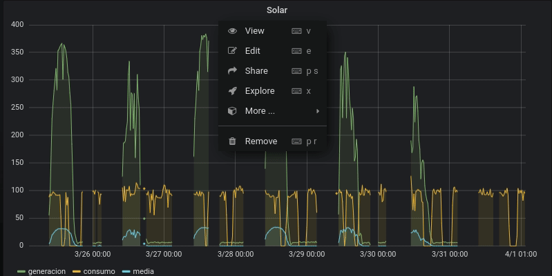

## Sistema de supervision y control

- <b>Vendor-free</b>. Aplicable a cualquier marca y modelo.  Realizado aplicaciones y componentes abiertos
- <b>Edge Computing<b>. Sus datos, seran solo suyos y accesibles siempre.  
- <b>Wireless</b>. La comunicacion es inalambrica e integrada en una micro-Fog genérica, privada, escalable y de alta disponibilidad.

### Importante

  

Consulte con nuestros ingenieros de control la  posible integracion de su Smart Home con nuestros equipos
  

